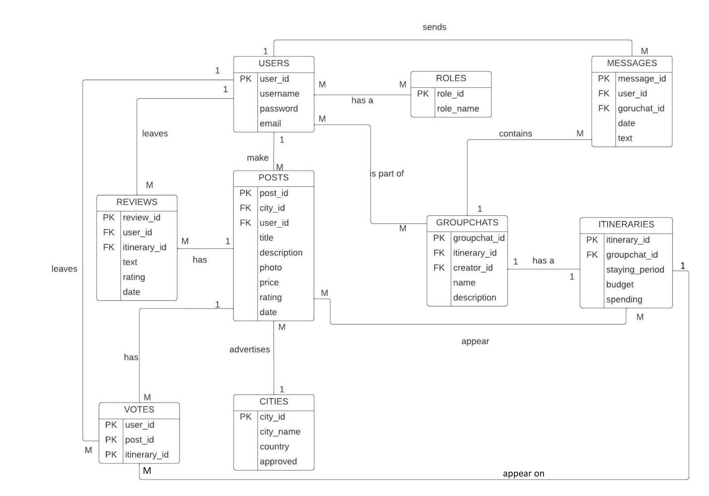
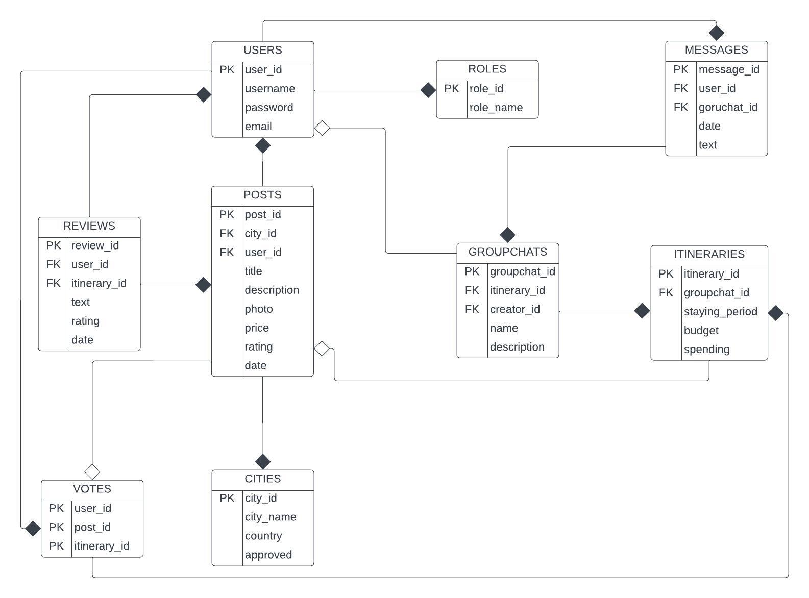
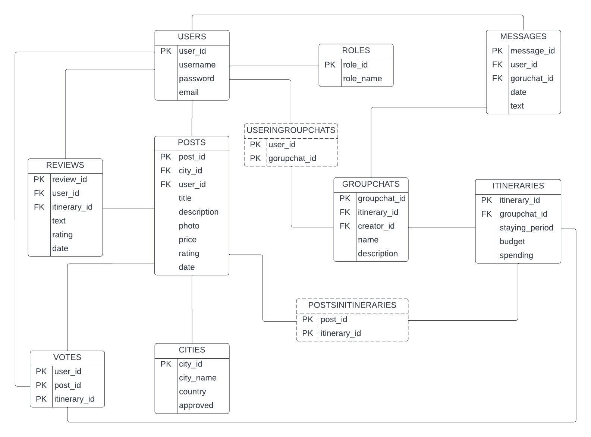

# TraveLust

## 1. User stories. Backlog creation
To keep track of the tasks and assign them to team members we used Jira. We created a dedicated project in Jira, where we logged our progress for each one of the three phases of the project. You can find it at the following link: https://urluconceptual.atlassian.net/jira/software/projects/TRAV/boards/1  

(Phase 1) As a user, I want to be part of a community that uploads suggestions for places to visit and things to do.  
(Phase 1) As a user, I want to be able to leave reviews and ratings for attractions, hotels, and restaurants in the itinerary so that other users can benefit from my experiences and make informed decisions.  
(Phase 1) As a user, I want to be able to find travel recommendations and reviews from other solo travelers who have visited my destination, so that I can plan a safe trip.  
(Phase 1) As a user, I want to be able to create a group chat and invite my friends to join so that we can plan our trip together.  

(Phase 2) As a user, I want to be able to plan my solo travels so that I can plan enjoyable trips.  
(Phase 2) As a user, I want to be able to set a budget for the trip and see how much each activity will cost so that we can stay within our budget.  
(Phase 2) As a user, I want a shared itinerary for each group chat so that my friends and I can access it easily and make changes as needed.  

(Phase 3) As a user, I want to be able to see the suggestions from my friends and add them to the itinerary so that we can all contribute to the planning.  
(Phase 3) As a user, I want to be able to vote on the places and activities that are suggested so that we can prioritize our choices based on the group's preferences.  
(Phase 3) As a user, I want to be able to set a total budget for the trip and track expenses in real-time, so that I can stay within my budget and avoid overspending.  

## 2. Charts
In order to visualize the structure and the relationships of the model we used the following diagrams:

## 3. Source control using GitHub
In the process of making TraveLust we used GitHub as our main version control system. We created a new repository to store our code, different branches for each one of the phases and we used pull requests to review and merge code changes. You can access the aforementioned GitHub repository at the following link: https://github.com/urluconceptual/social-media-TraveLust

## 4. Bug report and pull request solution
We identified a bug in the development process of TraveLust, namely, we noticed that when a post is liked by all users, the spending field was not updating. The code was committed and uploaded to GitHub on the phase3 branch, on Jun 15, 2023 and then a pull request was done, the bug was fixed and the code was committed and uploaded to GitHub the following hour.

## 5. Comments

In order to make the code easier to read and to understand we added comments all throughout the development process. These comments acted as documentation, as well as a way to communicate between team members, making the collaboration process easier, more efficient and more reliable.

## 6. AI Tools

We chose to use GitHub Copilot generated code in order to make the process of writing code easier and faster, but also to learn new ways of managing code tasks. These sections are clearly marked by comments.

## 7. [Demo](https://unibucro0-my.sharepoint.com/:v:/g/personal/andrei_nicolaescu_s_unibuc_ro/EdFrJMeTczxGsC7rJzcyXPABLjuYZQjtDtnAk0FNMv18dQ)
